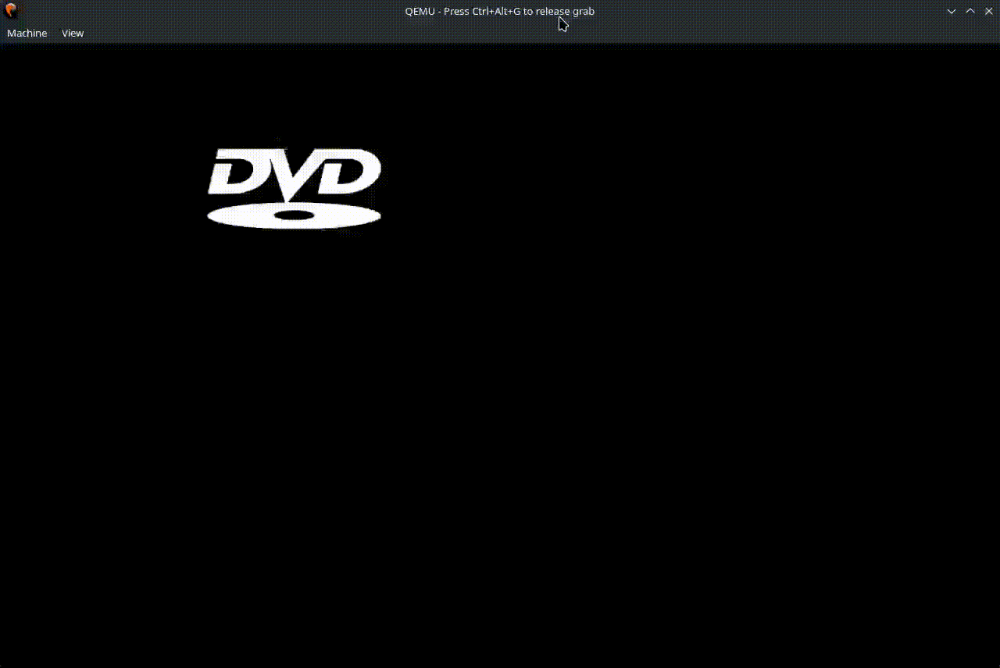

# DVDssrs
UEFI DVD Screen Saver written in rust.

## Execution
>[!NOTE]
>`.cargo/config.toml` File Involves full default path to the UEFI `/usr/share/edk2/ovmf/OVMF_CODE.fd` . Be sure that you have it

In order to run and test it using QEMU, you simply need to install uefi-run `cargo install uefi-run` . 
After installation, simply run : `cargo run --release`
